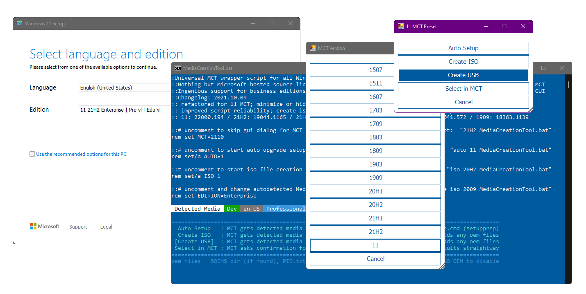

Not just an Universal MediaCreationTool wrapper script with ingenious support for business editions,  
  
A powerful yet simple windows 10 / 11 deployment automation tool as well!  
*If you had no success launching the script so far, this latest version will work*  

Presets  
-------  
1 ***Auto Upgrade*** with detected media, script assists setupprep for upgrading directly  
> _- can keep files and apps on more scenarios where os and target edition does not match_  
> _- can switch detected edition by adding EditionID to script name_  
> _- can troubleshoot upgrade failing by adding `no_update` to script name_  
> _- auto defaults to 11, so pass version as well for 10: `auto 21H2 MediaCreationTool.bat`_  

2 ***Auto ISO*** with detected media in current folder directly _(or C:\ESD if run from zip)_  
> _- can override detected media by adding edition name / language / arch to script name_  
> _- example: `21H1 Education en-US x86 iso MediaCreationTool.bat`_  

3 ***Auto USB*** with detected media in specified usb target  
> _- for data safety, this is not fully automated - must select the usb drive manually in GUI_  

4 ***Select*** with user picked Edition, Language, Arch (x86,x64,both) - on specified target  
> _- implicit choice, includes setup override files (disable by adding `def` to script name)_  

5 ***MCT Defaults*** runs unassisted, creating media without script modification  
> _- no added files, script passes `products.xml` to MCT and quits without touching media_  

1-4 presets will modify created media in the following ways:  
> _- write `auto.cmd` to run on demand for auto upgrade with edition switch and skip tpm_  
> _- write `$ISO$` folder content (if it exists) at the root of the media_  
> _if you previously used $OEM$ content, must now place it in `$ISO$\sources\$OEM$\`_  
> _- write `sources\PID.txt` to preselect edition at media boot or within windows (if configured)_  
> _- write `sources\EI.cfg` to prevent product key prompt on Windows 11 consumer media (11 only)_  
> _- write `AutoUnattend.xml` in boot.wim to enable local account on Windows 11 Home (11 only)_  
> _- patch `winsetup.dll` in boot.wim to remove windows 11 setup checks when booting from media (11 only)_  
> _- can disable by adding `def` to script name for a default, untouched MCT media_  

Simple deployment  
-----------------   
**auto.cmd** is behind ***Auto Upgrade*** preset via GUI  
Can run it fully unnatended by renaming script with `auto MediaCreationTool.bat`  
Makes it easy to upgrade keeping files and apps when the OS edition does not match the media  
Should allow upgrade from Ultimate, PosReady, Embedded, LTSC or Enterprise Eval as well  

Generated script is added to the created media so you can run it again at any time  
It is fairly generic - it will detect available editions in install.esd, pick a suitable index,  
then set EditionID in the registry to match; can even force another edition, keeping files and apps!  
On 11, it will try to skip setup checks (can disable this behavior with script var)  
Finally, it sets recommended setup options with least amount of issues on upgrades  

> Let's say the current OS is Enterprise LTSC 2019, and you use the business media to upgrade:  
> **auto.cmd** selects Enterprise index and adjust EditionID to Enterprise in the registry (backed up as EditionID_undo)  
> Maybe you also want to switch edition,  
> ex. by renaming the script to  `ProfessionalWorkstation MediaCreationTool.bat`:  
> **auto.cmd** selects Professional index and sets EditionID to ProfessionalWorkstation in the registry.  
>   
> Let's say the OS is Windows 7 Ultimate or PosReady, and you use the consumer media to upgrade:  
> **auto.cmd** selects Professional index, and sets EditionID to Professional or Enterprise, respectively.  
> In all cases, the script tries to pick an existing index, else a compatible one to keep files and apps on upgrade.  
>   
> Let's say you have a dozen PCs spread with versions: 7, 8.1, 10 and editions: Ultimate, Home, Enterprise LTSB..  
> If you need to upgrade all to the latest 10 version and only use Pro, you could rename the script as:  
> `auto 21H2 Pro MediaCreationTool.bat`  
>
> Can even add a VL / MAK / retail product key in the same way to take care of licensing differences.  
> The script also picks up any `$ISO$` folder in the current location - for $OEM$ branding, configuration, tweaks etc.  

Changelog  
---------  
_No need to right-click Run as Admin, script will ask itself. Directly saving the Raw files no longer breaks line endings_  
_We did it! We broke [the previous gist](https://git.io/MediaCreationTool.bat)_ ;) So this is the new home. **Thank you all!**  

[discuss on MDL](https://forums.mydigitallife.net/threads/universal-mediacreationtool-wrapper-script-create-windows-11-media-with-automatic-bypass.84168/)  

```
2018.10.10: reinstated 1809 [RS5]! using native xml patching for products.xml; fixed syntax bug with exit/b
2018.10.12: added data loss warning for RS5
2018.11.13: RS5 is officially back! + greatly improved choices dialog - feel free to use the small snippet in your own scripts
2019.05.22: 1903 [19H1]
2019.07.11: 1903 __release_svc_refresh__ and enable DynamicUpdate by default to grab latest CU
2019.09.29: UPDATED 19H1 build 18362.356 ; RS5 build 17763.379 and show build number
            added LATEST MCT choice to dinamically download the current version (all others have hard-coded links)
2019.11.16: 19H2 18363.418 as default choice (updated hard-coded links)
2020.02.29: 19H2 18363.592
2020.05.28: 2004 19041.264 first release
2020.10.29: 20H2 and aniversary script refactoring to support all MCT versions from 1507 to 20H2!!!
2020.10.30: hotfix utf-8, enterprise on 1909+
2020.11.01: fix remove unsupported options in older versions code breaking when path has spaces.. pff
2020.11.14: generate latest links for 1909,2004; all xml editing now in one go; resolved known cannot run script issues
2020.11.15: one-time clear of cached MCT, as script generates proper 1.0 catalog for 1507,1511,1703 since last update
            fixed compatibility with naked windows 7 powershell 2.0 / IPv6 / optional import $OEM$ / 1803+ business typo
            updated executables links for 1903 and 2004
2020.11.17: parse first commandline parameter as version, example: MediaCreationTool.bat 1909
2020.12.01: attempt to fix reported issues with 1703; no other changes (skipping 19042.630 leaked esd because it is broken)
2020.12.11: 20H2 19042.631; fixed pesky 1703 decryption bug on dual x86 + x64; improved cleanup; label includes version
2021.03.20: pre-release 21H1; optional auto upgrade or create media presets importing $OEM$ folder and key as PID.txt
2021.05.23: 21H1 release; enhanced script name args parsing, upgrade from embedded, auto.cmd / PID.txt / $OEM$ import
2021.06.06: create iso directly; enhanced dialogs; args from script name or commandline; refactoring is complete!
2021.08.04: done fiddling
2021.09.03: 21H2, both 10 and 11 [unreleased]
2021.09.25: Windows 11
            with Skip TPM Check on media boot as well as on dynamic update (standalone toggle script available)
            final touches for improved script reliability; enhanced auto upgrade preset; win 7 powershell 2.0 compatible
2021.09.30: fix Auto Setup preset not launching.. automatically
2021.10.04: fix for long standing tr localization quirks; Skip TPM Check v2 (ifeo-based instead of wmi)
2021.10.05: 11 22000.194 Release (rofl W11 MCT has limited capabilities, so still using 21H1 MCT because it works fine)
2021.10.09: outstanding refactoring around Windows 11 MCT; minimize while waiting MCT; unified 7 - 11 appearence
2021.10.20: create generic iso if no edition arg; use Downloads folder; no 11 setup checks on boot in VirtualBox; fixes #2
2021.10.23: 11 22000.258
            more intuitive presets; 11 setup override via AutoUnattend.xml or via boot.wim (for VirtualBox 5.x) with FIX arg
            only reliable ui automation; enhanced script output
2021.11.03: multiple download methods; improved automation; improved auto.cmd; moved autounattend.xml to boot.wim
            revising 11 setup bypass (wip) - not being content with any methods is the reason why I've not updated in a while
2021.11.09: skip windows 11 upgrade checks with setup.exe (not just auto.cmd); no server label; local account on 11 home
            auto.cmd has more fixes to keep files and apps on upgrade; reliable ui automation; alternative downloaders 
2021.11.15: 11 22000.318
            write output to script folder (or C:\ESD if run from zip); style: more consistent separation of arguments
            20H2 builds with esd size above 4GB that had to be reverted at 19042.631: en,de,es,pt,fr,it,jp,zh (MCT limits)
2021.11.16: 10 19044.1288 - official release of 10 21H2
            10 19043.1348 - newest 10 build - don't ask why ms is releasing these as such, it's not the first time
2021.12.07: skip windows 11 upgrade checks only via auto.cmd - just ignore server label, please
2021.12.15: fix regression with 1507-1709 not getting the correct fallback esd; fix dev '-noe' not autoclosing script
2021.12.22: improved auto.cmd handling of mismatched OS and target edition, obey 'def', 'auto' upgrades 7 to 10, not 11
2022.03.16: prevent launch errors when run from non-canonical paths; USBLayout progress; pickup $ISO$ dir to add on media
            DU in 11: auto installs 22000.556 atm; older skip_11_checks, without Server label; Home offline local account
2022.03.18: fix regression with Auto Upgrade; removed powershell -nop arg (issue #41); enhanced 11 AutoUnattend.xml
2022.03.20: stable - all issues ironed out; improved script ui; upgrade keeping files from Eval editions too
            last squash I promise ;)
```
